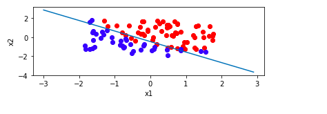

# Does Gaussian Discriminant Analysis perform better than Logistic Regression?

## Overview

I took two sets of data - one with Multivariate Gaussian Distribution and another non-gaussian. I then modeled linear classifier on both the sets with Gaussian Discriminant Analysis as well as Logistic Regression.

### GDA on gaussian data:

</a>

### Logistic Regression on gaussian data:

</a>

If p(x|y) is Gaussian, then p(y|x) is also logistic, hence both techniques output good classifiers. However, GDA performs better.

### GDA on non-gaussian data:

</a>

### Logistic Regression on non-gaussian data:

</a>

#### If p(y|x) is logistic, p(x|y) might not be Gaussian. Logistic regression should be chosen.

